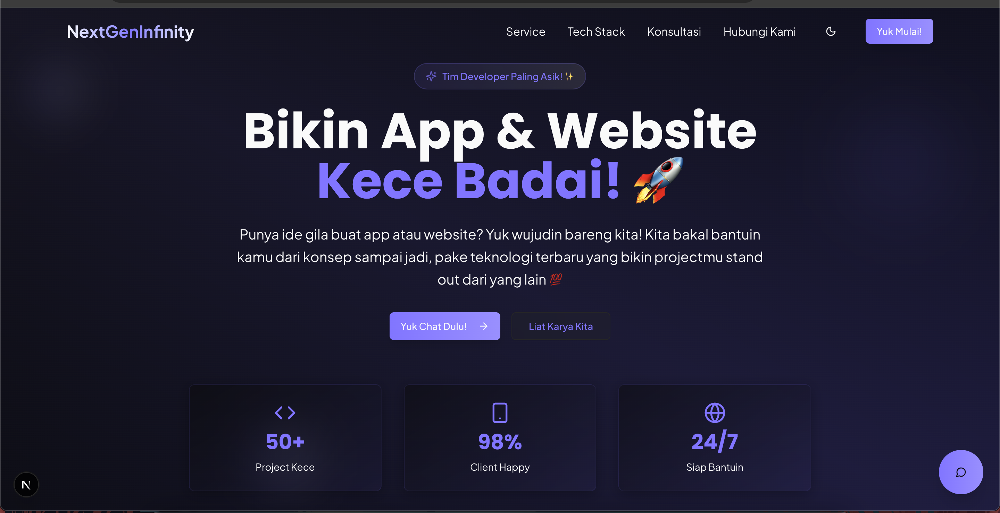
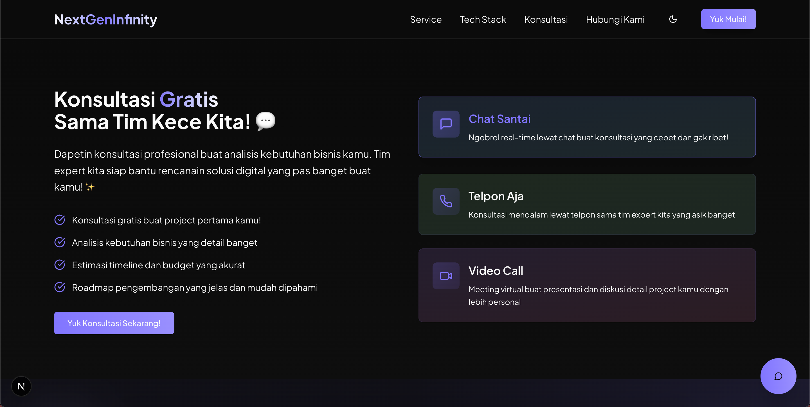
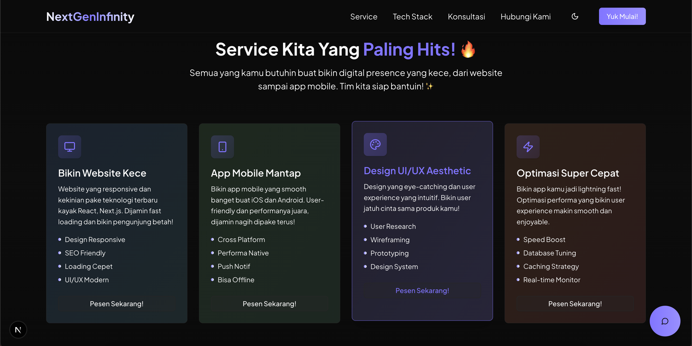

# NextGen Portfolio

A modern, responsive, and customizable portfolio built with Next.js, TypeScript, Tailwind CSS, and Framer Motion. Showcase your projects, skills, and experiences with a sleek UI and smooth animations.

## Features

- ⚡️ **Next.js 14**: Fast, SEO-friendly, and server-side rendered.
- 🎨 **Tailwind CSS**: Utility-first CSS for rapid UI development.
- 🛠 **TypeScript**: Type-safe codebase for reliability.
- 🎬 **Framer Motion**: Smooth page and component animations.
- 🌙 **Dark/Light Mode**: Toggle between themes.
- 📱 **Responsive Design**: Looks great on all devices.
- 🔒 **Environment Variables**: Secure API keys and configs.

## Demo

[Live Demo](https://your-portfolio-demo-link.com)

## Screenshots





## Getting Started

### 1. Clone the repository

```bash
git clone https://github.com/ahmdsk/next-gen-portfolio.git
cd next-gen-portfolio-v2
```

### 2. Install dependencies

```bash
npm install
# or
yarn install
```

### 3. Configure Environment Variables

Create a `.env.local` file in the root directory:

```env
RESEND_API_KEY="your_resend_api_key"
```

> **Note:**  
> - This API key is used for sending emails via Resend.
> - Replace `"your_resend_api_key"` with your actual Resend API key. You can obtain it by signing up at [Resend](https://resend.com).

### 4. Run the development server

```bash
npm run dev
# or
yarn dev
```

Open [http://localhost:3000](http://localhost:3000) to view it in your browser.

## Project Structure

```
.
├── components/      # Reusable UI components
├── app/           # Next.js pages (routes)
├── public/          # Static assets (images, icons)
├── styles/          # Global styles
├── utils/           # Utility functions
├── data/            # Portfolio data (projects, skills, etc.)
├── .env.local       # Environment variables
└── README.md
```

## Customization

- **Edit `data/` files** to update your projects, skills, and personal info.
- **Update theme** in `tailwind.config.js`.

## Deployment

Deploy easily to [Vercel](https://vercel.com/) (recommended):

[](https://vercel.com/import/project?template=https://github.com/ahmdsk/next-gen-portfolio)

Or use your preferred hosting provider.

## Contributing

Pull requests are welcome! For major changes, please open an issue first.

## License

[MIT](./LICENSE)

---

> Inspired by the best modern portfolios and open-source projects.
