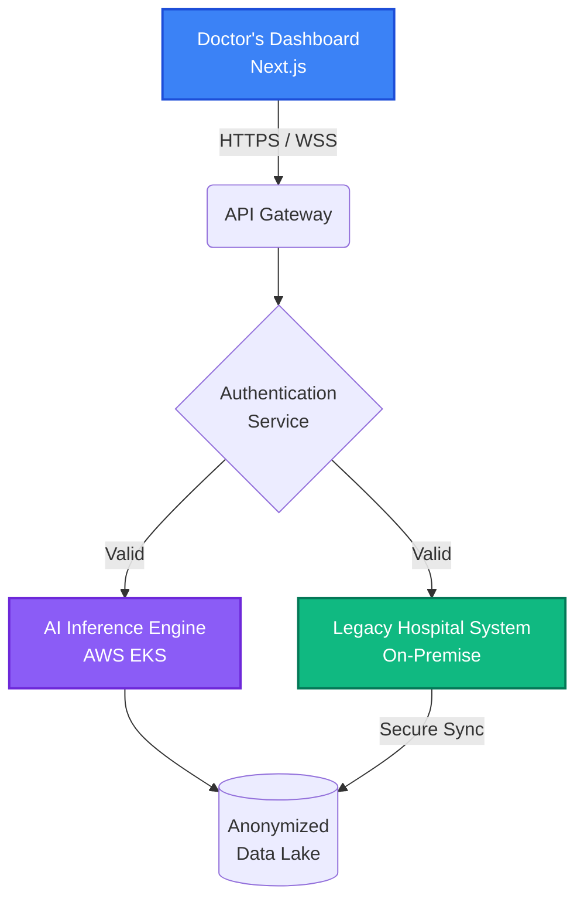

# Healthcare AI Modernization

## The Challenge

MediCore Systems provides hospital management software to over 200 clinics nationwide. Their legacy system was monolithic and strictly on-premise, lacking the capability to integrate modern AI-driven diagnostic tools. They needed a secure, HIPAA-compliant way to modernize their infrastructure and introduce cloud-based AI inference without exposing sensitive patient data.

## Our Approach

NextGenInfinity proposed a hybrid-cloud architecture. We built a secure bridge between their on-premise systems and an isolated AWS environment dedicated to AI processing.

1.  **Hybrid Cloud Bridge**: Establishing an AWS Direct Connect link to ensure secure, low-latency data transfer.
2.  **AI Inference API**: Deploying containerized machine learning models using Kubernetes, accessible via a secure gRPC API.
3.  **Modern Dashboard**: Building a new Next.js interface for doctors to view AI insights directly alongside patient records.

## System Architecture

## The Results

The integration revolutionized how doctors at MediCore clinics interact with patient data.
- **Improved Diagnostics**: AI insights are now generated in under 2 seconds during patient consultations.
- **Security Compliance**: Achieved full HIPAA compliance with end-to-end encryption.
- **Future-Proof**: The new microservices layer allows MediCore to add new AI models in days instead of months.

> "The speed and security with which NextGenInfinity modernized our platform is unparalleled. They are true elite engineers."
> — *Chief Medical Information Officer, MediCore Systems*
