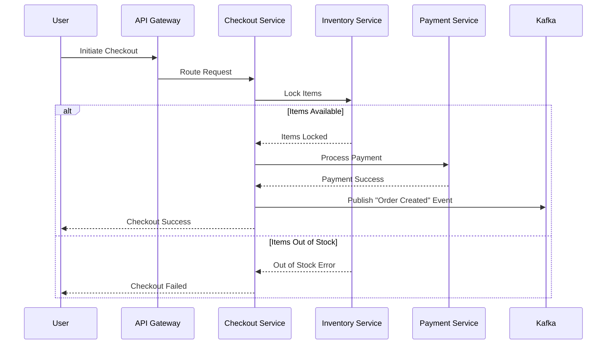

# Tech Indo Ecommerce Scaling

## The Challenge

TechIndo Nusantara, one of the leading tech decacorns in Indonesia, was facing critical infrastructure bottlenecks. During high-traffic events like *Harbolnas* (Hari Belanja Online Nasional), their monolithic architecture would struggle to keep up, resulting in slow page loads, failed transactions, and massive revenue loss. They needed a highly scalable, distributed system that could auto-scale instantaneously.

## Our Approach

NextGenInfinity collaborated directly with TechIndo's core engineering team to implement a highly resilient, event-driven microservices architecture. 

1.  **Decoupling the Monolith**: Breaking down the core services (Inventory, Checkout, Payment) into independent microservices.
2.  **Event-Driven Communication**: Implementing Apache Kafka to handle high-throughput asynchronous events.
3.  **Database Sharding**: Migrating their massive PostgreSQL database into a distributed cluster using Citus.

## The Solution Architecture

The new architecture guarantees high availability and massive horizontal scalability. Below is the simplified flow of the new checkout process:

## The Results

The impact was phenomenal. During the next Harbolnas event, TechIndo achieved:
- **Zero Downtime**: The system handled 5 million concurrent users flawlessly.
- **Latency Reduction**: 99th percentile (p99) API latency dropped from 2.5s to 120ms.
- **Revenue Protection**: Achieved 100% transaction success rate during peak traffic spikes.

> "The collaboration with NextGenInfinity has been incredible. They've provided not only the code, but also a world-class architectural foundation for TechIndo's future."
> — *VP of Engineering, TechIndo Nusantara*
